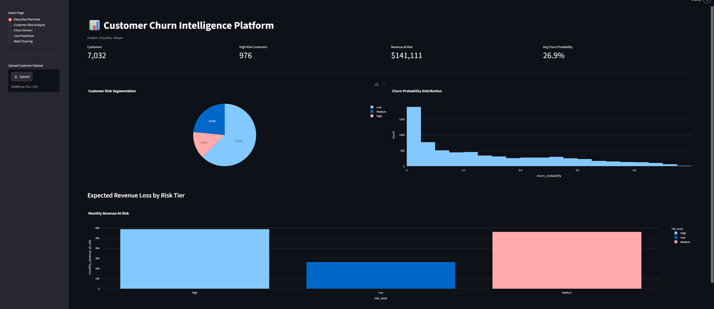
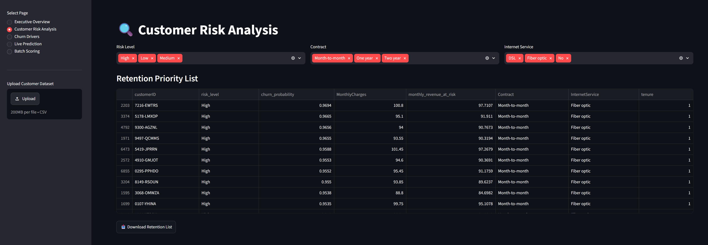
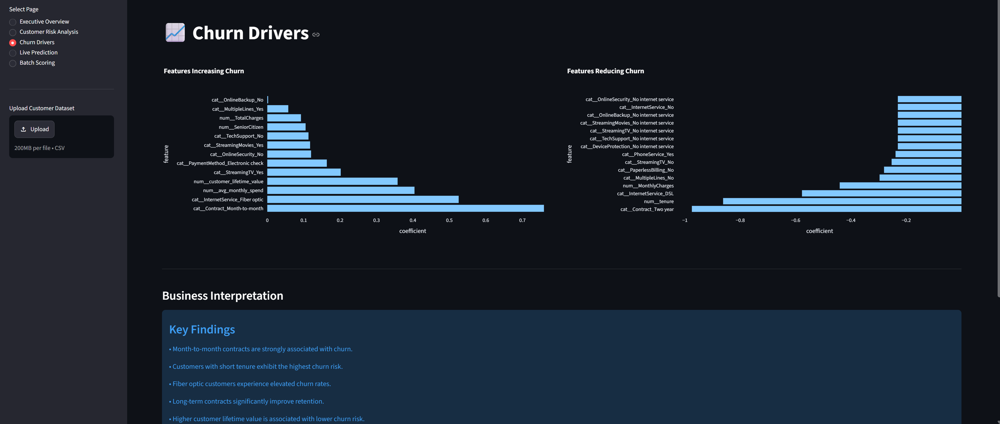
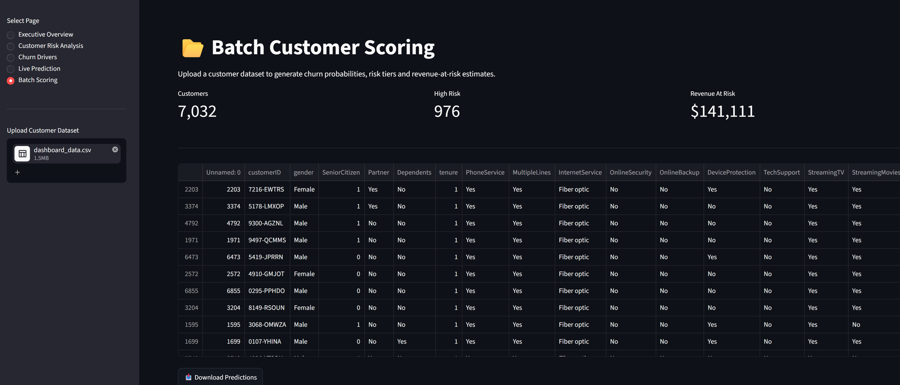

# 📊 Customer Churn Intelligence Platform

Predict • Prioritize • Retain

An end-to-end Data Science and Machine Learning project that predicts customer churn, identifies high-risk customers, quantifies revenue exposure, and provides actionable business intelligence through an interactive Streamlit dashboard.

---

## Live Application

**Streamlit App:**

[Insert Streamlit URL Here]

---

## Dashboard Preview

### Executive Overview



Provides a high-level business overview including customer count, churn risk distribution, average churn probability, and estimated revenue at risk.

---

### Customer Risk Analysis



Allows business teams to filter customers by risk level, contract type, and internet service while generating prioritized retention lists.

---

### Churn Drivers



Visualizes the most influential features driving customer churn and retention using Logistic Regression coefficients.

---

### Live Prediction


Predict churn probability for an individual customer and estimate associated revenue exposure.

---

### Batch Scoring



Upload an entire customer dataset and generate churn predictions, risk segmentation, and revenue-at-risk estimates in bulk.

---

# Project Background

Customer churn is one of the most significant challenges faced by subscription-based businesses. Every customer lost represents not only immediate revenue loss but also the additional cost required to acquire a replacement customer.

Telecommunication companies are especially vulnerable because customers can easily switch providers when they perceive better pricing, service quality, or contract flexibility elsewhere.

This project develops a Customer Churn Intelligence Platform that enables businesses to proactively identify customers at risk of leaving before churn occurs.

The platform combines predictive analytics, customer segmentation, and business intelligence to support data-driven retention strategies.

---

# Business Problem

Retention teams frequently face three major challenges:

### 1. Unknown Churn Risk

Organizations often do not know which customers are likely to leave until after churn has already occurred.

### 2. Limited Retention Resources

Businesses cannot realistically target every customer and must prioritize intervention efforts toward the most vulnerable customers.

### 3. Lack of Revenue Visibility

Traditional churn models often provide predictions without quantifying the financial consequences of customer attrition.

---

# Project Objectives

The project was designed to:

* Predict customer churn probability using machine learning.
* Identify customers at high risk of leaving.
* Segment customers into actionable risk tiers.
* Quantify monthly revenue exposure.
* Explain key churn drivers.
* Build an interactive dashboard for business stakeholders.
* Support both individual and bulk customer scoring.

---

# 📂 Dataset

### Source

IBM Telco Customer Churn Dataset

Dataset Link:

https://www.kaggle.com/datasets/blastchar/telco-customer-churn

Original Provider:

IBM Sample Data Assets

---

### Dataset Description

The dataset contains customer-level information from a telecommunications company including demographic information, subscribed services, billing details, contract information, and churn status.

### Dataset Size

* Approximately 7,000 customers
* 21 predictor variables
* 1 target variable (Churn)

---

### Features

#### Customer Demographics

* Gender
* Senior Citizen
* Partner
* Dependents

#### Account Information

* Tenure
* Contract Type
* Payment Method
* Paperless Billing

#### Services

* Internet Service
* Phone Service
* Multiple Lines
* Online Security
* Online Backup
* Device Protection
* Streaming TV
* Streaming Movies
* Technical Support

#### Financial Information

* Monthly Charges
* Total Charges

#### Target Variable

* Churn (Yes/No)

---

# Methodology

The project follows a complete end-to-end machine learning workflow.

## 1. Data Cleaning

* Converted TotalCharges to numeric format.
* Removed missing observations.
* Validated feature types.

## 2. Exploratory Data Analysis

Analyzed:

* Churn distribution
* Customer demographics
* Contract behavior
* Service subscriptions
* Revenue patterns
* Retention trends

## 3. Feature Engineering

Created business-oriented features:

### Customer Lifetime Value

```python
customer_lifetime_value = MonthlyCharges * tenure
```

### Average Monthly Spend

```python
avg_monthly_spend = MonthlyCharges / (tenure + 1)
```

## 4. Model Development

Three classification algorithms were evaluated:

* Logistic Regression
* Random Forest
* XGBoost

## 5. Hyperparameter Tuning

RandomizedSearchCV was used to optimize XGBoost parameters.

## 6. Model Evaluation

Performance was assessed using:

* Accuracy
* Precision
* Recall
* F1-Score
* ROC-AUC

## 7. Dashboard Development

Built using:

* Streamlit
* Plotly
* Pandas
* Scikit-Learn

---

# Model Results

| Model               | ROC-AUC |
| ------------------- | ------- |
| Logistic Regression | 0.8447  |
| Random Forest       | 0.8128  |
| XGBoost             | 0.8134  |

---

## Selected Model

### Logistic Regression

Logistic Regression was selected as the production model.

Reasons:

* Highest ROC-AUC score.
* Comparable performance to tuned XGBoost.
* Faster inference.
* Lower maintenance complexity.
* Easier interpretation.
* Better business explainability.

Following the engineering principle of **Occam's Razor**, the simpler model was chosen because it achieved equivalent predictive performance while offering greater transparency and operational efficiency.

---

# Key Business Insights

Analysis revealed that:

* Month-to-month contracts are strongly associated with churn.
* Customers with short tenure have the highest churn risk.
* Fiber optic customers exhibit elevated churn rates.
* Long-term contracts significantly improve customer retention.
* Customers with higher lifetime value are generally less likely to churn.

---

# Application Features

## Executive Dashboard

Provides:

* Customer count
* Churn probability overview
* Revenue at risk
* Customer risk segmentation

---

## Customer Risk Analysis

Provides:

* Risk filtering
* Contract filtering
* Service filtering
* Retention prioritization list
* Downloadable customer lists

---

## Churn Drivers

Provides:

* Feature importance rankings
* Positive churn drivers
* Negative churn drivers
* Business recommendations

---

## Live Prediction

Allows users to:

* Enter customer information
* Estimate churn probability
* Estimate revenue exposure
* Generate customer risk classifications

---

## Batch Scoring

Allows users to:

* Upload customer datasets
* Score customers in bulk
* Generate churn probabilities
* Generate revenue-at-risk estimates
* Download prediction results

---

# Installation

## Clone Repository

```bash
git clone https://github.com/YOUR_USERNAME/customer-churn-intelligence-platform.git
```

```bash
cd customer-churn-intelligence-platform
```

---

## Create Virtual Environment

```bash
python -m venv .venv
```

Activate:

### Windows

```bash
.venv\Scripts\activate
```

### Mac/Linux

```bash
source .venv/bin/activate
```

---

## Install Dependencies

```bash
pip install -r requirements.txt
```

---

## Run Application

```bash
streamlit run app.py
```

---

# 📁 Project Structure

```text
customer-churn-intelligence-platform/

│
├── images/
│   ├── executive_dashboard.png
│   ├── customer_risk_analysis.png
│   ├── churn_drivers.png
│   ├── live_prediction.png
│   └── batch_scoring.png
│
├── app.py
├── notebook.py
├── dashboard_data.csv
├── feature_importance.csv
├── telco_churn_probability_estimator_lr.joblib
├── data.csv
├── requirements.txt
├── README.md
└── .env
```

---

#  How To Use

## Executive Dashboard

Monitor customer risk and revenue exposure across the customer portfolio.

## Customer Risk Analysis

Identify high-priority customers for retention campaigns.

## Churn Drivers

Understand factors influencing customer churn and retention.

## Live Prediction

Predict churn probability for individual customers.

## Batch Scoring

Upload a CSV containing the required model features and receive scored predictions.

Required columns:

* gender
* SeniorCitizen
* Partner
* Dependents
* tenure
* PhoneService
* MultipleLines
* InternetService
* OnlineSecurity
* OnlineBackup
* DeviceProtection
* TechSupport
* StreamingTV
* StreamingMovies
* Contract
* PaperlessBilling
* PaymentMethod
* MonthlyCharges
* TotalCharges
* avg_monthly_spend
* customer_lifetime_value

---

# Future Improvements

Potential enhancements include:

### Explainable AI

* SHAP Values
* Local Prediction Explanations

### Customer Lifetime Value Forecasting

* Future customer value estimation

### Retention Recommendation Engine

* Personalized retention actions

### MLOps

* Automated retraining
* Model monitoring
* Data drift detection

### Cloud Deployment

* AWS
* Azure
* Google Cloud Platform

### Real-Time API

* CRM integration
* REST endpoints

### Advanced Modeling

* LightGBM
* CatBoost
* Stacking Ensembles
* Neural Networks

---

# Tech Stack

* Python
* Pandas
* NumPy
* Scikit-Learn
* XGBoost
* Streamlit
* Plotly
* Matplotlib
* Seaborn
* Joblib

---

# 👤 Author

**Bantar Harris**

Data Science • Machine Learning • Business Analytics

---
